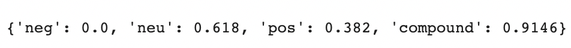
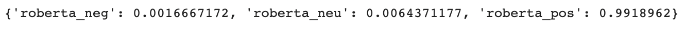
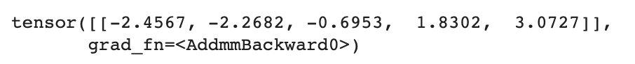

# NLP Sentiment Analysis - Amazon Product Reviews

### Technical Description in Non-Technical Terms
This project’s goal is to analyze comments provided by customers by determining if the given review is associated with the following sentiment: ‘positive’, ‘negative’ or ‘neutral’; and to apply Ai-powered methods for sentiment prediction based on actual rated reviews provided by customers. In this data science project, we are exclusively analyzing reviews of every whey protein product available (as of February 2023) for sell at Amazon. Whey Protein powder is a sporting supplement (based on dairy milk) consumed commonly by athletes, body-builders and anyone who wants or needs additional protein on their diet. How do we obtain our data? By scraping (automatically extracting) pages one through ten from the comments’ section for every single product available when searching for the terms ‘Whey Protein’ at Amazon’s (E-Commerce website) searchbar. What is the main tool for this project? We used Python 3 – programming language for both web scraping and applying both multiple Natural Language Processing (NLP) techniques and statistical methods / data science prediction models. The output CSV file for each model (except Naive Bayes) is stored at the DATA_RESULTS folder - an explanation for each of the model's output is written below the 'Jupyter Notebook Links' section. 

### Presentation GIF

<b>Click the following link to see PowerPoint Presentation (PDF format):</b> https://github.com/Juan-Moctezuma/NLP_Sentiment_Analysis-Amazon_Product_Reviews/blob/main/Amazon_Product_Review_Sentiment_Analysis.pdf

### Steps
1. <b>Web Scraping</b>
2. <b>Data Preprocessing</b>
3. <b>Exploratory Data Analysis</b>
4. <b>Machine Learning Models - for training & prediction</b>
   * <b>VADER - Valence Aware Dictionary & Sentiment Reasoner (Bag of words approach)</b>
   * <b>Roberta Model - Transformer-based model by Hugging Face</b>
   * <b>Bert neural network</b>
   * <b>Linear Regression (for analyzing Bert's outputs)</b>
   * <b>Text Blob - Python's Built-in library</b>
   * <b>Naive Bayes Algorithm approach</b>
5. <b>Business / Product Analysis - learning from negative sentiment for product and service improvements</b>

### Jupyter Notebook Links
Multiple steps or processes were required for the completion of this project. The following bullet points lists the name of process and the Jupyter Notebook containing the Python code with splitted steps and comments:
1. <b>Web Scraper</b> - Data extraction phase - https://github.com/Juan-Moctezuma/NLP_Sentiment_Analysis-Amazon_Product_Reviews/blob/main/Part1-Whey_Protein_Amazon_Reviews_Scraper.ipynb
2. <b>Data Preprocessing</b> - Data manipulation phase - https://github.com/Juan-Moctezuma/NLP_Sentiment_Analysis-Amazon_Product_Reviews/blob/main/Part2-Amazon_Reviews_Data_Preprocessing.ipynb
3. <b>Exploratory Data Analysis</b> - Process of making graphs and charts to visualize data and verify if our data is appropriate - https://github.com/Juan-Moctezuma/NLP_Sentiment_Analysis-Amazon_Product_Reviews/blob/main/Part3-Amazon_Reviews_Data_Exploration.ipynb
4. Application of Machine Learning techniques and statistical methods for sentiment analysis and prediction:
    * <b>Vader model vs. Roberta model</b>  - https://github.com/Juan-Moctezuma/NLP_Sentiment_Analysis-Amazon_Product_Reviews/blob/main/Part4-Whey_Protein_Sentiment_Analysis_Pre-trained_Models-Vader_vs_Roberta.ipynb
    * <b>Bert neural network / linear regression model</b> - https://github.com/Juan-Moctezuma/NLP_Sentiment_Analysis-Amazon_Product_Reviews/blob/main/Part5-Whey_Protein_Sentiment_Analysis_Pre-trained_BERT_Neural_Network.ipynb
    * <b>TextBlob</b> - Python Library - https://github.com/Juan-Moctezuma/NLP_Sentiment_Analysis-Amazon_Product_Reviews/blob/main/Part6-Whey_Protein_Sentiment_Analysis_Pre-trained_TextBlob.ipynb
    * <b>Naive Bayes Classifier</b> - based on Bayes' Probability Theorem - https://github.com/Juan-Moctezuma/NLP_Sentiment_Analysis-Amazon_Product_Reviews/blob/main/Part7-Whey_Protein_Sentiment_Analysis_Naive_Bayes_Classifier.ipynb
5. <b>Business Analysis: Understanding Customer's Negative Sentiments</b> - https://github.com/Juan-Moctezuma/NLP_Sentiment_Analysis-Amazon_Product_Reviews/blob/main/Part8-Business_Analysis-Root_Cause_of_Negative_Sentiments.ipynb

### Models' Outputs (for each Amazon comment or review analyzed)
1. Vader Model - Decimal values (negative, neutral, positive, and compound - sum of previously mentioned attributes).
**See example:** 
2. Roberta Model - Decimal values (negative, neutral & positive).
**See example:**
3. Bert Model - Vector with decimal values (each position represents 1,2,3,4,5; the bigger and more negative at 3th, 4th, 5th positions implies a 'negative sentiment'). These decimals get rounded (hence we get an integer) to simulate a predicted 'Amazon Star' (5 being the maximum value).
**See example:** 
4. TextBlob Model - polarity and subjectivity. Polarity score lies between (-1 to 1) where -1 identifies negative words (such as ‘bad’, ‘awful’, ‘pathetic’, etc) and 1 identifies positive words (like ‘excellent’, ‘best’, etc.). Subjectivity score lies between (0 and 1), and it shows the amount of personal opinion. If a sentence has high subjectivity i.e. close to 1, it resembles that the text contains more personal opinion than factual information.
5. Naive Bayes - Accuracy of prediction (probability percentage).

### Technologies
1. Microsoft Office:
   * Excel
   * PowerPoint
2. Jupyter Notebook (Python 3)
3. Python 3 Dependencies:
   * AutoModelForSequenceClassification (for Roberta & Bert models)
   * AutoTokenizer (for Roberta model)
   * BeautifulSoup (for webscraping)
   * datetime
   * decimal
   * math
   * matplotlib
   * nltk (for TextBlob library)
   * numpy
   * pandas
   * re
   * requests
   * seaborn
   * SentimentIntensityAnalyzer (for Vader model)
   * sklearn (for Bert model & Naive Bayes algorithm)
   * softmax
   * statsmodels (for Bert model)
   * scipy
   * textblob (library or model itself)
   * torch (for Bert model)
   * tqdm (for Vader model)
4. Requirements
   * attr==0.3.2
   * attrs==22.2.0
   * beautifulsoup4==4.12.0
   * ConfigParser==5.3.0
   * contextlib2==21.6.0
   * cryptography==40.0.1
   * Cython==0.29.33
   * dl==0.1.0
   * docutils==0.19
   * HTMLParser==0.0.2
   * ipython==8.12.0
   * ipywidgets==8.0.4
   * Jinja2==3.1.2
   * jnius==1.1.0
   * keyring==23.13.1
   * lockfile==0.12.2
   * mock==5.0.1
   * numpy==1.21.6
   * pandas==1.5.3
   * Pillow==9.5.0
   * protobuf==4.22.1
   * pyOpenSSL==23.1.1
   * railroad==0.5.0
   * Sphinx==6.1.3
   * tornado==6.2
   * trove_classifiers==2023.3.9
   * truststore==0.6.1
   * urllib3_secure_extra==0.1.0
   * xmlrpclib==1.0.1

### Other Knowledge required for the completion of this project 
1. Applied Mathematics & Statistics
2. Machine Learning & Data Science methods
3. Shell scripting (with Bash) & UNIX commands for setting up computer for Python 3.8
4. Web Scraping (with Python 3)
5. Data Analytics
6. Business Acumen
